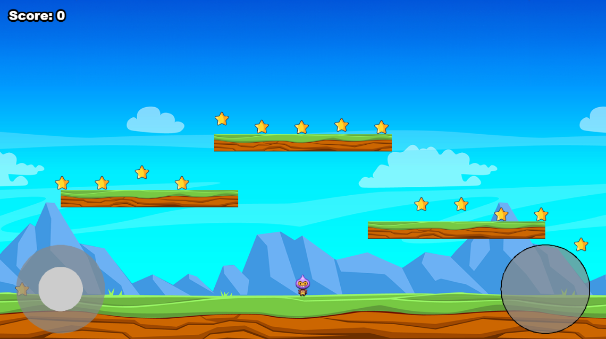

# Jogo Bomb-Boy feito com Phaser 3, Template Vite e Javascript

O jogo se baseia no tutorial fornecido pela Phaser e usa o template vite. O jogo possui mecânicas básicas e algumas outras inserirdas como forma de aprendizado. Link do tutorial base do jogo: https://phaser.io/tutorials/making-your-first-phaser-3-game-portuguese.

## Design do Jogo (Cena principal)



## Mecânicas e funcionalidades do Jogo

- [x] Personagem anda para os lados e pula
- [x] Coleta de _stars_ e aumento pontos
- [x] Bombas (inimigos) caem e matam o personagem se encostar
- [x] Gameover se uma bomba encostar no personagem
- [x] Jogabilidade pelo **Teclado**:
  - [x] Setas direira e esqueda movem o personagem
  - [x] Seta cima faz o personagem pular
  - [x] Tecla _espaço_ faz o personagem pular
  - [x] Tecla ENTER ou click do mouse muda de scene.
- [x] Jogabilidade pelo **Gamepad**:
  - [x] Axes Sticks movem o personagem para direita e esquerda
  - [x] Botão X faz o personagem pular
  - [x] Botão X muda de scene (simula click do mouse).
- [x] Jogabilidade pelo **Touch (Mobile)**:
  - [x] Axes virutal movem o personagem para direita e esquerda
  - [x] Botão virtual faz o personagem pular
  - [x] Botão virtual muda de scene (simula click do mouse)
- [ ] Efeitos de Som
  - [ ] Efeito de som quando o player coleta uma star
  - [ ] Efeito de som quando o player toca em uma bomba
  - [ ] Musica de background

## Criação do Projeto via _Template Phaser Game App_

Link para instalação do template: https://phaser.io/tutorials/create-game-app.

### Criar um projeto básico

```
npm create @phaserjs/game@latest
```

> [!NOTE] > **[Esse template também fornece uma versão com Typescript.](https://github.com/phaserjs/template-vite-ts)**

### Requisitos

[Node.js](https://nodejs.org) é necessário para instalar as dependências e executar os scripts via `npm`.

### Comandos disponíveis no template

| Comando         | Descrição                                                                               |
| --------------- | --------------------------------------------------------------------------------------- |
| `npm install`   | Instala as dependências do projeto                                                      |
| `npm run dev`   | Executa a aplicação criando um servidor web local disponível em `http://localhost:8080` |
| `npm run build` | Cria o build final em uma pasta chamada `dist`                                          |

## Estrutura do Projeto

O template cria um projeto padrão com a seguinte estrutura:

- `index.html` - Um HTML básico que conterá o jogo.
- `src` - Códigos fontes do jogo (scenes, componentes, ...)
- `src/main.js` - Ponto de entrada do jogo. Contém o arquivo de configuração do jogo e a sua criação.
- `src/scenes/` - Scenes do jogo.
- `public/style.css` - CSS simples para o layout da página HTML.
- `public/assets` - Contém os assets do jogo.
- `dist` - Contém os arquivos finais do jogo após o comando de build. OBS: Essa pasta só é criado quando realiza-se o build (_npm run build_).

## Pacotes ou Plugins utilizados

Os seguintes pacotes foram utilizados:

### Phaser 3 Rex Plugins

Plugin utilizado para criar um gamepad virtual com axes para movimentação do personagem quando estiver executando em Mobile. Link da página guia para utilização do plugin: https://rexrainbow.github.io/phaser3-rex-notes/docs/site/virtualjoystick/

**Instalação**:

```
npm i phaser3-rex-plugins
```
